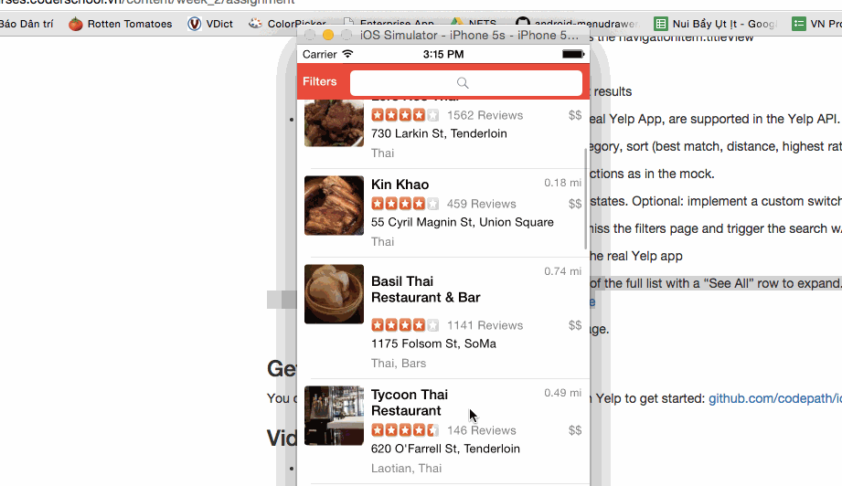

### Basic Yelp client

This is a headless example of how to implement an OAuth 1.0a Yelp API client. The Yelp API provides an application token that allows applications to make unauthenticated requests to their search API.

### Next steps

- Check out `BusinessesViewController.swift` to see how to use the `Business` model.

### Sample request

**Basic search with query**

```
Business.searchWithTerm("Thai", completion: { (businesses: [Business]!, error: NSError!) -> Void in
    self.businesses = businesses
    
    for business in businesses {
        println(business.name!)
        println(business.address!)
    }
})
```

**Advanced search with categories, sort, and deal filters**

```
Business.searchWithTerm("Restaurants", sort: .Distance, categories: ["asianfusion", "burgers"], deals: true) { (businesses: [Business]!, error: NSError!) -> Void in

    for business in businesses {
        println(business.name!)
        println(business.address!)
    }
}
```
Completed:

[] Required: Table rows should be dynamic height according to the content height.
[] Required: Custom cells should have the proper Auto Layout constraints.
[] Required: Search bar should be in the navigation bar (doesn't have to expand to show location like the real Yelp app does).
[] Required: The filters you should actually have are: category, sort (best match, distance, highest rated), radius (meters), deals (on/off).
[] Required: The filters table should be organized into sections as in the mock.
[] Required: You can use the default UISwitch for on/off states. Optional: implement a custom switch
[] Required: Clicking on the “Search” button should dismiss the filters page and trigger the search w/ the new filter settings. 
[] Optional: Radius filter should expand as in the real Yelp app
[] Optional: Categories should show a subset of the full list with a “See All” row to expand. A formatted list of categories available in the Public API can be found here

